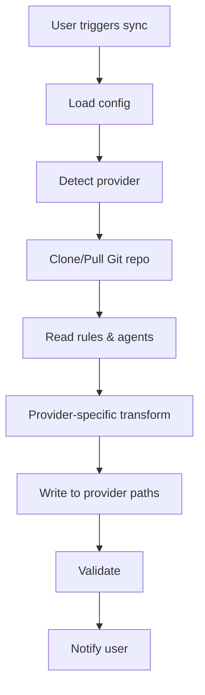

# VibeKit Architecture

## 🎯 Mục tiêu

VibeKit tự động hóa việc sync rules và slash commands (agents) từ Git repository về các AI Editors.

## 🏗️ Kiến trúc Tổng quan

### Multi-Extension Strategy

```
VibeKit Monorepo
├── VSCode Extension (Universal)
│   ├── Cursor Support
│   ├── Windsurf Support
│   ├── Antigravity Support
│   └── Generic VSCode Support
└── Zed Extension (Native)
    └── Zed Slash Commands
```

### Quyết định: 1 Extension cho VSCode-based Editors

**Lý do:**

- ✅ Code reuse tối đa
- ✅ Maintenance dễ dàng hơn
- ✅ Consistent UX
- ✅ Dễ dàng thêm provider mới

## 🔧 VSCode Extension Architecture

### Provider Pattern

```typescript
interface RulesProvider {
  // Metadata
  name: string;
  displayName: string;

  // Detection
  detect(): boolean;

  // Paths
  getRulesPath(): string;
  getAgentsPath(): string;
  getConfigPath(): string;

  // Operations
  syncRules(content: string): Promise<void>;
  syncAgents(agents: Agent[]): Promise<void>;
  validateConfig(): Promise<boolean>;
}
```

### Supported Providers

#### 1. Cursor Provider

**Detection:**

```typescript
detect(): boolean {
  return vscode.env.appName.includes('Cursor');
}
```

**Paths:**

- Rules: `.cursorrules`
- Agents: `.cursor/agents/` hoặc custom location
- Config: `.cursor/config.json`

**Features:**

- Sync `.cursorrules` file
- Sync custom agents/commands
- Support Cursor-specific syntax

#### 2. Windsurf Provider

**Detection:**

```typescript
detect(): boolean {
  return vscode.env.appName.includes('Windsurf') ||
         vscode.env.appName.includes('Codeium');
}
```

**Paths:**

- Rules: `.windsurfrules`
- Cascade: `.windsurfcascade/`
- Agents: Custom location

**Features:**

- Sync `.windsurfrules`
- Support cascade system
- Windsurf-specific features

#### 3. Antigravity Provider

**Detection:**

```typescript
detect(): boolean {
  return vscode.env.appName.includes('Antigravity');
}
```

**Paths:**

- Rules: `.agent/` directory
- Workflows: `.agent/workflows/`
- Memory: `.agent/memory/`

**Features:**

- Sync `.agent/` structure
- Support workflows
- Memory management

#### 4. Generic VSCode Provider

**Fallback** cho các VSCode editors khác.

**Paths:**

- Rules: `.vscode/rules/`
- Agents: `.vscode/agents/`

### Core Modules

#### 1. Git Module

```typescript
class GitService {
  async cloneRepo(url: string, target: string): Promise<void>;
  async pullLatest(path: string): Promise<void>;
  async getRemoteRules(url: string): Promise<RulesConfig>;
}
```

#### 2. Sync Module

```typescript
class SyncService {
  constructor(private provider: RulesProvider);

  async syncFromGit(repoUrl: string): Promise<void>;
  async syncRules(): Promise<void>;
  async syncAgents(): Promise<void>;
  async watchChanges(): Promise<void>;
}
```

#### 3. Config Module

```typescript
interface VibeKitConfig {
  gitRepo: string;
  autoSync: boolean;
  syncInterval: number; // minutes
  provider: "auto" | "cursor" | "windsurf" | "antigravity" | "generic";
  customPaths?: {
    rules?: string;
    agents?: string;
  };
}
```

## 📁 File Structure

```
vscode/
├── src/
│   ├── providers/
│   │   ├── base.ts              # Base provider interface
│   │   ├── cursor.ts            # Cursor implementation
│   │   ├── windsurf.ts          # Windsurf implementation
│   │   ├── antigravity.ts       # Antigravity implementation
│   │   ├── generic.ts           # Generic VSCode
│   │   └── factory.ts           # Provider factory
│   ├── core/
│   │   ├── git.ts               # Git operations
│   │   ├── sync.ts              # Sync logic
│   │   ├── config.ts            # Configuration
│   │   └── watcher.ts           # File watcher
│   ├── ui/
│   │   ├── statusBar.ts         # Status bar item
│   │   ├── quickPick.ts         # Quick pick menus
│   │   └── notifications.ts     # User notifications
│   ├── commands/
│   │   ├── sync.ts              # Sync commands
│   │   ├── config.ts            # Config commands
│   │   └── index.ts             # Command registry
│   └── extension.ts             # Entry point
├── package.json
└── README.md
```

## 🔄 Workflow

### 1. Extension Activation

```typescript
export async function activate(context: vscode.ExtensionContext) {
  // 1. Detect provider
  const provider = ProviderFactory.detect();

  // 2. Load configuration
  const config = await ConfigService.load();

  // 3. Initialize sync service
  const syncService = new SyncService(provider, config);

  // 4. Register commands
  registerCommands(context, syncService);

  // 5. Setup auto-sync if enabled
  if (config.autoSync) {
    await syncService.startAutoSync();
  }

  // 6. Show status bar
  StatusBar.show(provider.displayName);
}
```

### 2. Sync Process



### 3. Auto-sync

```typescript
class AutoSyncService {
  private interval: NodeJS.Timeout;

  start(intervalMinutes: number) {
    this.interval = setInterval(async () => {
      await this.syncService.syncFromGit();
    }, intervalMinutes * 60 * 1000);
  }

  stop() {
    clearInterval(this.interval);
  }
}
```

## 🎨 User Experience

### Commands

- `VibeKit: Sync Rules & Agents` - Manual sync
- `VibeKit: Configure Git Repository` - Set repo URL
- `VibeKit: Enable Auto-Sync` - Enable auto-sync
- `VibeKit: Disable Auto-Sync` - Disable auto-sync
- `VibeKit: Show Current Provider` - Display detected provider
- `VibeKit: Force Provider` - Override auto-detection

### Configuration

```json
{
  "vibekit.gitRepo": "https://github.com/user/rules-repo",
  "vibekit.autoSync": true,
  "vibekit.syncInterval": 30,
  "vibekit.provider": "auto",
  "vibekit.customPaths.rules": ".custom/rules",
  "vibekit.customPaths.agents": ".custom/agents"
}
```

### Status Bar

```
[VibeKit: Cursor] ✓ Synced 2m ago
```

Click để show quick actions:

- Sync now
- Configure
- View logs

## 🧪 Testing Strategy

### Unit Tests

```typescript
describe("CursorProvider", () => {
  it("should detect Cursor editor", () => {
    // Mock vscode.env.appName
    expect(provider.detect()).toBe(true);
  });

  it("should return correct paths", () => {
    expect(provider.getRulesPath()).toBe(".cursorrules");
  });
});
```

### Integration Tests

```typescript
describe("SyncService", () => {
  it("should sync rules from git", async () => {
    await syncService.syncFromGit("https://...");
    // Verify files created
  });
});
```

## 🚀 Phased Implementation

### Phase 1: Core Infrastructure

- [ ] Provider interface
- [ ] Git service
- [ ] Config service
- [ ] Basic sync logic

### Phase 2: Provider Implementations

- [ ] Cursor provider
- [ ] Windsurf provider
- [ ] Antigravity provider
- [ ] Generic provider

### Phase 3: UI & UX

- [ ] Commands
- [ ] Status bar
- [ ] Notifications
- [ ] Quick picks

### Phase 4: Advanced Features

- [ ] Auto-sync
- [ ] File watcher
- [ ] Conflict resolution
- [ ] Backup/restore

### Phase 5: Testing & Polish

- [ ] Unit tests
- [ ] Integration tests
- [ ] Documentation
- [ ] Examples

## 🔮 Future Enhancements

### Multi-repo Support

```json
{
  "vibekit.repos": [
    {
      "url": "https://github.com/team/shared-rules",
      "type": "rules"
    },
    {
      "url": "https://github.com/user/personal-agents",
      "type": "agents"
    }
  ]
}
```

### Template System

```typescript
interface RuleTemplate {
  name: string;
  description: string;
  content: string;
  variables: Record<string, string>;
}
```

### Marketplace Integration

- Share rules/agents với community
- Browse và install từ marketplace
- Rating và reviews

## 📊 Alternative Considered

### Option 2: Separate Extensions

**Pros:**

- Simpler per-extension code
- Smaller package size per editor
- Editor-specific optimizations

**Cons:**

- ❌ Code duplication (3-4x)
- ❌ Harder to maintain
- ❌ Inconsistent UX
- ❌ More testing overhead

**Verdict:** ❌ Không khuyến nghị

## 🎯 Recommendation

**✅ Implement 1 Universal VSCode Extension** với provider pattern:

1. **Easier to maintain** - 1 codebase thay vì 3-4
2. **Better code quality** - Shared logic được test kỹ hơn
3. **Faster development** - Thêm provider mới chỉ cần implement interface
4. **Consistent UX** - User experience giống nhau
5. **Future-proof** - Dễ dàng thêm editors mới

## 📝 Next Steps

1. Review architecture này
2. Implement core infrastructure (Phase 1)
3. Implement Cursor provider first (most popular)
4. Test với real Cursor installation
5. Add Windsurf và Antigravity providers
6. Polish UX và documentation
7. Release beta version

---

**Questions for Review:**

1. Provider pattern có phù hợp không?
2. Có cần thêm providers nào khác?
3. Config structure có đủ linh hoạt không?
4. Có features nào cần ưu tiên hơn?
