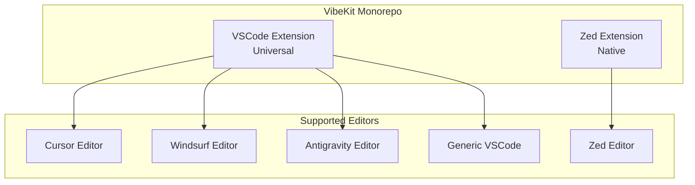
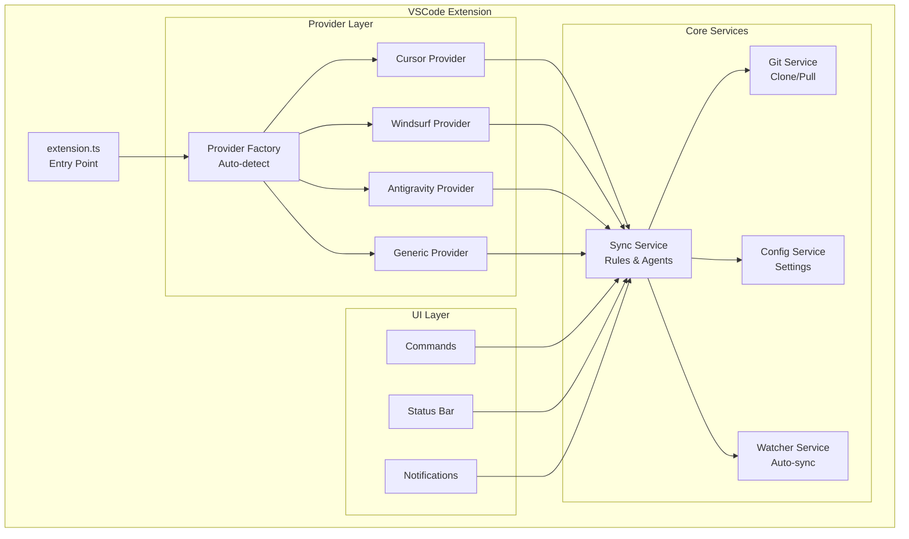
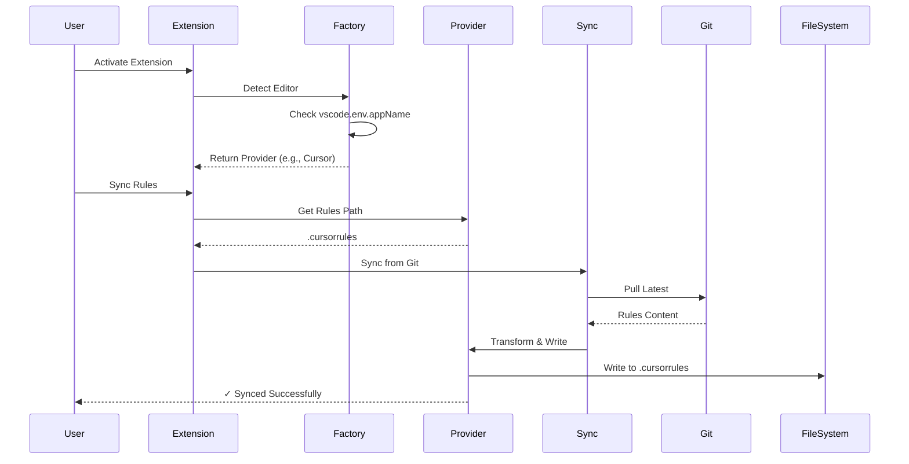
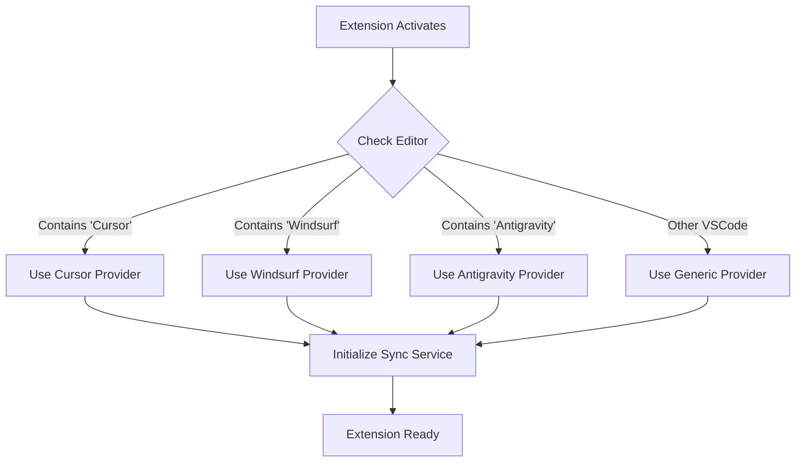
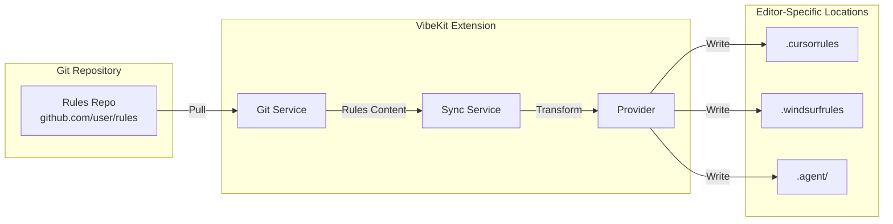

# VibeKit Visual Architecture

## 🏗️ Recommended Architecture: Single Universal Extension

### High-Level Overview



### VSCode Extension Internal Architecture



### Provider Pattern Flow



### File Structure Comparison

#### ✅ Recommended: Single Extension

```
vscode/
├── src/
│   ├── providers/           # 750 lines total
│   │   ├── base.ts         # Interface (50 lines)
│   │   ├── cursor.ts       # 200 lines
│   │   ├── windsurf.ts     # 200 lines
│   │   ├── antigravity.ts  # 200 lines
│   │   ├── generic.ts      # 100 lines
│   │   └── factory.ts      # Auto-detection
│   ├── core/               # 1000 lines (SHARED)
│   │   ├── git.ts
│   │   ├── sync.ts
│   │   ├── config.ts
│   │   └── watcher.ts
│   ├── ui/                 # 300 lines (SHARED)
│   ├── commands/           # 200 lines (SHARED)
│   └── extension.ts        # 100 lines
└── package.json

Total: ~2,350 lines
```

#### ❌ Alternative: Multiple Extensions

```
extensions/
├── cursor/
│   ├── src/
│   │   ├── core/          # 1000 lines (DUPLICATED)
│   │   ├── ui/            # 300 lines (DUPLICATED)
│   │   ├── commands/      # 200 lines (DUPLICATED)
│   │   ├── cursor.ts      # 200 lines
│   │   └── extension.ts   # 100 lines
│   └── package.json
├── windsurf/
│   ├── src/
│   │   ├── core/          # 1000 lines (DUPLICATED)
│   │   ├── ui/            # 300 lines (DUPLICATED)
│   │   ├── commands/      # 200 lines (DUPLICATED)
│   │   ├── windsurf.ts    # 200 lines
│   │   └── extension.ts   # 100 lines
│   └── package.json
└── antigravity/
    ├── src/
    │   ├── core/          # 1000 lines (DUPLICATED)
    │   ├── ui/            # 300 lines (DUPLICATED)
    │   ├── commands/      # 200 lines (DUPLICATED)
    │   ├── antigravity.ts # 200 lines
    │   └── extension.ts   # 100 lines
    └── package.json

Total: ~5,400 lines (130% duplication!)
```

### Provider Detection Logic



### Sync Workflow



## 🎯 Decision Summary

### ✅ Single Universal Extension

**Pros:**

- ✅ 80% less code duplication
- ✅ 2.2x faster development
- ✅ 3x easier maintenance
- ✅ Consistent UX
- ✅ Easy to add new providers
- ✅ Better tested (shared logic)

**Cons:**

- ⚠️ Slightly more complex (provider pattern)
- ⚠️ Larger package size (~500KB vs ~400KB)

---

**Recommendation: Implement Single Universal Extension với Provider Pattern** ✅
